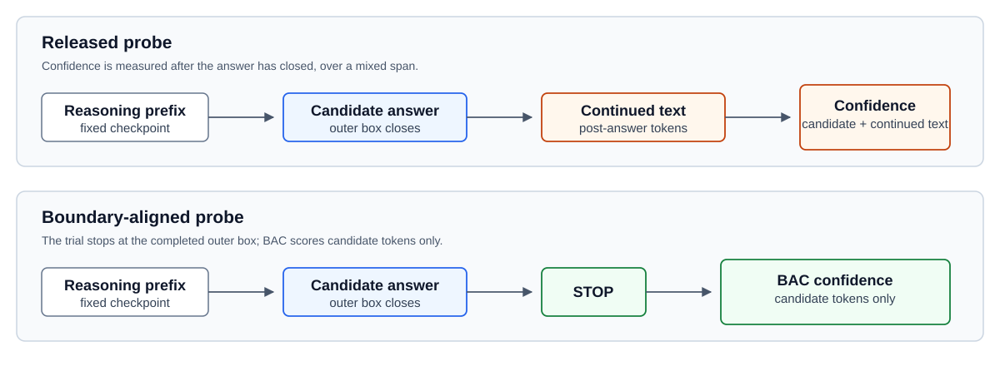

# Reasoning Confidence Audit

## Reproducing and Stress-Testing Confidence-Based Early Stopping in Reasoning LLMs

This repository is a compact, public audit of confidence-based early stopping
for reasoning language models. It reproduces and examines the released
[CoDE-Stop](https://github.com/sudoparsa/CoDE-Stop) measurement path, packages
aggregate evidence from the completed Q0–Q7 sandbox, and freezes one next
study. It contains no model weights, raw reasoning traces, raw token-logprob
traces, benchmark rows, or upstream source code.

## What this project studies

The central question is:

> Does measuring confidence only over the completed candidate answer, combined
> with risk-controlled threshold selection, provide a safer and cheaper
> early-stopping signal than the released CoDE-Stop confidence measurement?

The completed work is an audit, not a new deployed stopping method. The next
study is a pre-specified protocol and has **not** been run.

## Why confidence-based early stopping matters

Reasoning models can spend many tokens continuing after they have enough
information to answer. Early stopping could reduce that cost, but a wrong
confidence measurement can turn a token-saving decision into a wrong-answer
decision. This audit asks whether the released probe confidence is measuring
the candidate answer alone or a mixture of the answer and text generated after
it.

## What we reproduced

[CoDE-Stop](https://arxiv.org/abs/2604.04930) samples designated reasoning
checkpoints, forces a candidate answer, turns greedy token probabilities into a
confidence-like signal, and combines that signal with its released stopping
logic. Q3–Q6 reproduced and audited this measurement path without modifying
CoDE-Stop. Q7 then held the prompt, reasoning-prefix token IDs, forced suffix,
and greedy decoding fixed while comparing quantization formats.

The historical discovery sandbox used `Qwen3-4B` in `Q4_K_M`. It is not a
faithful BF16 reproduction. See [docs/methodology.md](docs/methodology.md) and
[docs/experiment_timeline.md](docs/experiment_timeline.md) for the frozen
sequence.

## What we found

### ESTABLISHED OBSERVATIONS

- In the studied Q4 batches, released probes often continued after a candidate
  answer had already closed. That post-answer text was included in the released
  confidence span.
- The independent, preregistered Q6 holdout reproduced this boundary issue.
- Ending Q6 probes at the already-completed candidate boundary would reduce
  trial-probe generation from 756 to 156 tokens: **a 79.37% counterfactual
  reduction in trial-probe generated tokens on the Q6 holdout.** It is not a
  claim about total inference savings or answer accuracy.
- Q7 found that Q8 is substantially closer to BF16 than Q4 in candidate
  identity on its frozen-prefix samples.

### EXPLORATORY OBSERVATIONS

- In the Q3 development batch, Boundary-Aligned Confidence (BAC) ranked
  candidate correctness much more strongly than the released full-span signal.
- Q6 contained zero correct probe candidates, so that ranking could not be
  evaluated on the holdout.

### ONGOING QUESTION

- Can boundary-aligned confidence plus risk-controlled threshold selection
  provide a safer accuracy/compute trade-off? The protocol is frozen in
  [docs/next_study_protocol.md](docs/next_study_protocol.md); no claim is made
  until that study completes.

## The measurement boundary

BAC is the standard geometric mean of the pre-specified candidate-answer token
probabilities, stopping at the matching outer `\boxed{...}` close. No
post-box token is included.



The figure is conceptual. It illustrates the measurement boundary, not a new
model architecture or an established performance result.

## Precision check: Q4 vs Q8 vs BF16

Q7 is a controlled fixed-prefix probe study, not an end-to-end benchmark.

| Frozen paired checkpoints | Exact normalized candidate agreement |
| --- | ---: |
| Q8_0 vs Q4_K_M | 15 / 30 |
| BF16 vs Q8_0 | 11 / 12 |
| BF16 vs Q4_K_M | 5 / 12 |

Q4 BAC rankings were partly aligned with the higher-precision formats, but
candidate fidelity was not established. Consequently, Q4 is retained as a
historical exploratory/discovery backend; Q8 is the primary practical
validation backend; and BF16 is a selective fidelity anchor. The Q7 BF16 set
is only 12 frozen checkpoints, so it does not establish full-model fidelity.

`TQ1_0` is recorded only as a negative extreme post-training ternary stress
condition: it completed 0 of 32 candidate boxes and was unusable for candidate
or BAC comparison. It is not treated as a BitNet-style trained ternary model.
See [docs/findings.md](docs/findings.md) and the compact
[Q7 result](results/q7_precision_summary.json).

## Current research direction

The next direction is deliberately narrow:
**BOUNDARY-ALIGNED CONFIDENCE + RISK-CONTROLLED EARLY STOPPING.**

```text
CoDE-style checkpoint
  -> force a candidate answer
  -> stop the trial when its outer box closes
  -> compute BAC over candidate tokens only
  -> select an upper stopping threshold on calibration data with UCB risk control
  -> evaluate accuracy, risk, and total generated-token cost on untouched test data
```

The study will compare the released confidence signal and BAC under the **same**
upper-threshold risk-control procedure. It does not add semantic redundancy,
PUMA, ternary quantization, CUSUM, a lower/unsolvable threshold, or another
stopping signal. Related work and the deliberate boundary are documented in
[docs/research_overview.md](docs/research_overview.md) and
[docs/related_work.md](docs/related_work.md). The corrected pre-inference
design uses 200 deterministically selected MATH500 examples (100 calibration,
100 untouched test) and operating points `epsilon = 0.15, 0.20`; see
[docs/protocol_feasibility.md](docs/protocol_feasibility.md).

## Repository structure

```text
docs/       Research overview, frozen next-study protocol, findings, limits, and resume text
figures/    One editable conceptual SVG
results/    Compact aggregate metrics and artifact provenance only
src/        Reusable audit package and a standard-library result packager
tests/      Synthetic offline tests; no model, GPU, dataset, or network required
examples/   A small synthetic released-span-versus-boundary demo
licenses/   Upstream-license and attribution notices
```

## Core implementation

`src/reasoning_confidence/` exposes the clean, reusable audit logic developed
from the frozen experiments:

- candidate-boundary detection with nested-brace handling;
- released full-span confidence reconstruction and BAC;
- released-style checkpoint membership handling;
- a manually configured, greedy local llama.cpp `/completion` probe that stops
  at the candidate boundary; and
- small helpers for candidate agreement, paired confidence comparison, and
  probe-token accounting.

The package is intentionally small and uses the Python standard library. It
does not start a server, load a model, contain upstream source code, or claim
to reproduce all Q0–Q7 inference end-to-end without the separate frozen
artifact tree. See [src/README.md](src/README.md) for the public API boundary.

## Reproducing the analyses

Run the synthetic implementation checks from the repository root:

```powershell
$env:PYTHONPATH = "src"
python -m unittest discover -s tests -v
python examples\synthetic_probe_demo.py
```

They use only synthetic token and log-probability fixtures. No GPU, weights,
dataset, network access, or llama.cpp server is required.

The 5–10 minute public check rebuilds the compact result summary without a
model, server, or dataset download:

```powershell
python src\rebuild_public_results.py --output results\rebuilt_aggregate_results.json
```

The command reads [results/aggregate_inputs.json](results/aggregate_inputs.json)
and produces the same public schema as
[results/aggregate_results.json](results/aggregate_results.json). The output is
ignored by Git so it can be inspected locally.

If you have access to the separate frozen artifact tree, the packager can
rebuild the compact inputs from aggregate JSON only:

```powershell
python src\rebuild_public_results.py --artifact-root <path-to-frozen-artifacts> --output <output-path>
```

It reads no model weights and starts no inference runtime. A complete
inference rerun requires the upstream repositories, model and dataset terms,
pinned revisions, and appropriate local hardware; see
[docs/environment.md](docs/environment.md).

## Limitations

This repository does not claim a faithful BF16 reproduction, an end-to-end
accuracy improvement, a new state of the art, a validated new stopping method,
a publication or submission, or 79% total inference saving. The completed
evidence is bounded by the recorded model revision, prompts, datasets,
checkpoint semantics, quantization formats, and sample sizes. Q4 results must
not be assumed to generalize to BF16.

See [docs/limitations.md](docs/limitations.md) for the full scope and
[docs/publication_scope.md](docs/publication_scope.md) for the conditional
paper story.

## References

- Parsa Hosseini, Sumit Nawathe, Mahdi Salmani, Meisam Razaviyayn, and Soheil
  Feizi. [*Early Stopping for Large Reasoning Models via Confidence
  Dynamics*](https://arxiv.org/abs/2604.04930), 2026. Upstream implementation:
  [sudoparsa/CoDE-Stop](https://github.com/sudoparsa/CoDE-Stop), audited at
  commit `b5081e7c2abe23bb1d19649421cc13522fee7c50`.
- [*Conformal Thinking*](https://arxiv.org/abs/2602.03814), 2026. Used as the
  related risk-control reference for the next-study protocol only.
- [*PUMA / Stop When Reasoning Converges*](https://arxiv.org/abs/2605.17672),
  2026. Related work only; semantic redundancy is outside this study.
- [*From token probabilities to calibrated confidence*](https://arxiv.org/abs/2608.07827),
  2026. Related work only; its calibration methods are not part of the primary
  method.

See [CITATION.cff](CITATION.cff) and
[licenses/UPSTREAM_NOTICES.md](licenses/UPSTREAM_NOTICES.md) for citation and
license details.
